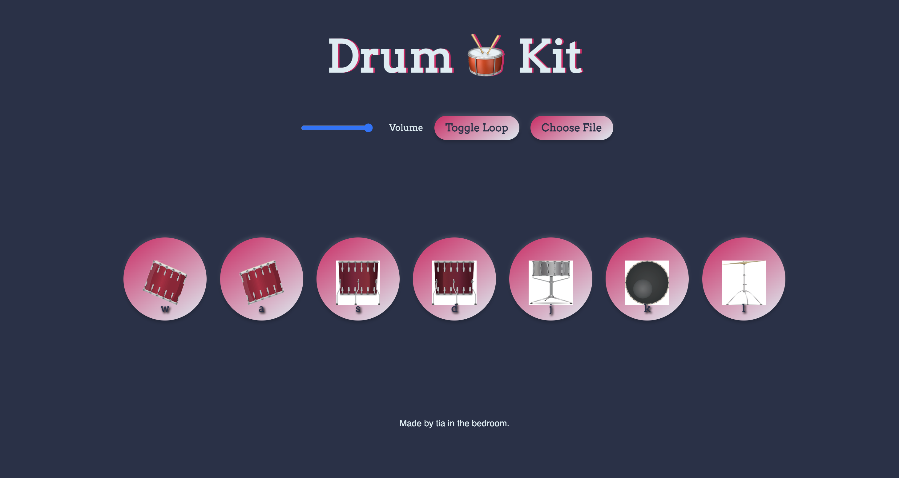

# Drum Kit 🥁

A fun and interactive Drum Kit project built with **HTML**, **CSS**, and **JavaScript**. This project allows users to play drum sounds either by clicking buttons or pressing corresponding keys. It also includes advanced features like volume control, loop mode, and custom sound uploads.

## Preview

## How to Use
1. Open [Drum Kit Website](https://tia-cheng.github.io/drumKit/)in your favorite browser.
2. Interact with the drum kit:
   - Click drum buttons or press keys (`w`, `a`, `s`, `d`, `j`, `k`, `l`).
   - Use the volume slider to adjust the sound.
   - Enable "Loop Mode" to loop drum beats.
   - Upload custom sounds using the "Choose File" button.

## Keyboard Mapping

- **W**: Snare
- **A**: Hi-hat
- **S**: Open hi-hat
- **D**: Boom
- **J**: Kick
- **K**: Tom
- **L**: Ride

## Technologies Used

- **HTML**: Structure and layout.
- **CSS**: Styling with gradients, hover effects, and animations.
- **JavaScript**: Dynamic interactions and sound management.

## New Features

### 1. Volume Control
- Adjust the sound volume using the slider provided in the control panel.

### 2. Loop Mode
- Toggle looping with the "Toggle Loop" button.
- When active, the drum sounds are automatically played in a loop.

### 3. Custom Sound Upload
- Use the "Choose File" button to upload your own audio file.
- The uploaded file is played immediately upon selection.

## Future Enhancements

- Add more drum sounds.
- Introduce tempo control for loop mode.
- Add keyboard shortcuts for volume and loop toggling.

## Contribution

If you'd like to contribute to this project, feel free to fork the repository and submit a pull request!
